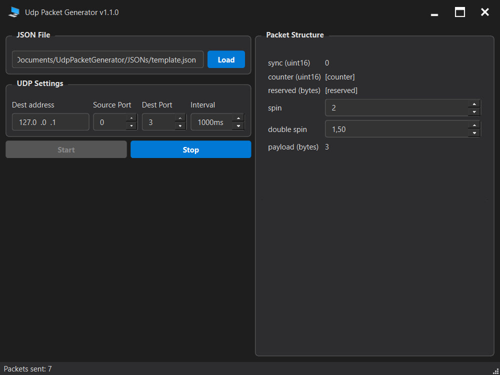

## En [Ru](README_RU.md)

# UDP Packet Generator [](https://github.com/IamKornitskiy/UdpPacketGenerator/releases) [](https://www.gnu.org/licenses/gpl-3.0)
[](https://www.qt.io/)


A flexible UDP packet generator configured entirely through JSON templates.

## About

UDP Packet Generator creates and sends custom UDP packets based on a JSON template.  
Define packet fields with different types, set them as constants, counters, or user inputs.

## Features

- **JSON-based packet structure** – fields, types, sizes, and value sources in one file
- **Rich field types** – integers, floats, strings, JSON, NMEA, reserved bytes, and counters
- **Built-in validation** – JSON syntax are checked before sending
- **Real-time editing** – modify input values on the fly; packets update immediately
- **Cross-platform** – runs on Windows, Linux, and can be built for macOS

## 🗺 Roadmap

### ✅ Already implemented (v2.0.0)
- [x] Integer fields (`uint8`–`uint32`, `int8`–`int32`) with configurable byte order
- [x] Floating-point fields (`float32`, `float64`)
- [x] String field (`string`) with UTF-8 support
- [x] JSON field with automatic syntax validation
- [x] Auto-incrementing counter (`counter`)
- [x] Real-time value editing without stopping transmission
- [x] Cross-platform build (Windows, Linux) with signed packages (deb, rpm, AppImage, zip)

### 🚧 Under active development (v2.1.x)

- [ ] **CSV field** – column count validation
- [x] **Visual error highlighting** in text editors for invalid data
- [x] **NMEA field** with checksum validation
- [ ] **Check for new version**

### 🔜 Planned (v2.2.x and beyond)
- [ ] Packet duplication to multiple targets
- [ ] Visual packet editor – drag-and-drop field creation in GUI
- [ ] Save/load scenarios (field values)
- [ ] Base64 field for text-safe binary data
- [ ] Real-time traffic monitor (rate, counters, graph)
- [ ] Additional encodings (Latin-1, UTF-16)
- [ ] Plugin system for custom field types and validators

## Screenshot



## Build

### Requirements

- **Qt 6.8+** (Core, Gui, Widgets, Network)
- **CMake 3.16+**
- **C++17 compiler** (MSVC 2019+, GCC 9+, Clang 10+)

```bash
git clone https://github.com/IamKornitskiy/UdpPacketGenerator.git
cd UdpPacketGenerator
mkdir build && cd build
cmake .. -DCMAKE_PREFIX_PATH=/path/to/Qt/6.8.0/gcc_64
cmake --build .
```

## Usage

1. **Load a JSON template** – click `Load` and select a `.json` file with packet description.
2. **Edit input fields** – if the template contains `input` fields, set their values in the right panel.
3. **Set destination** – enter target IP address and port.
4. **Set source (optional)** – specify local port, or leave `0` for automatic selection.
5. **Choose interval** – set the transmission period in milliseconds.
6. **Start** – press `Start` to begin sending packets.

## JSON Template

Packet structure is defined in a JSON file.  
See [`templates/`](templates/) for examples and a detailed guide on writing your own templates.

If you create a JSON template for a well-known protocol or packet, feel free to submit a pull request — I'll be happy to add it to the collection.

## License

This project is licensed under the GNU General Public License v3.0 – see the [LICENSE](LICENSE) file for details.
