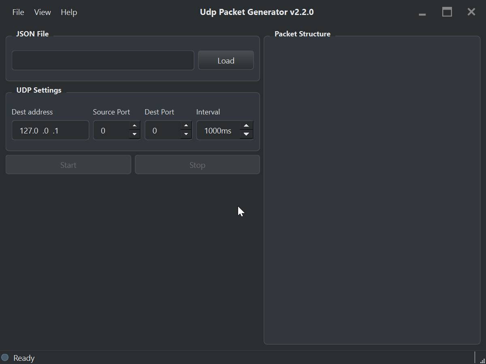
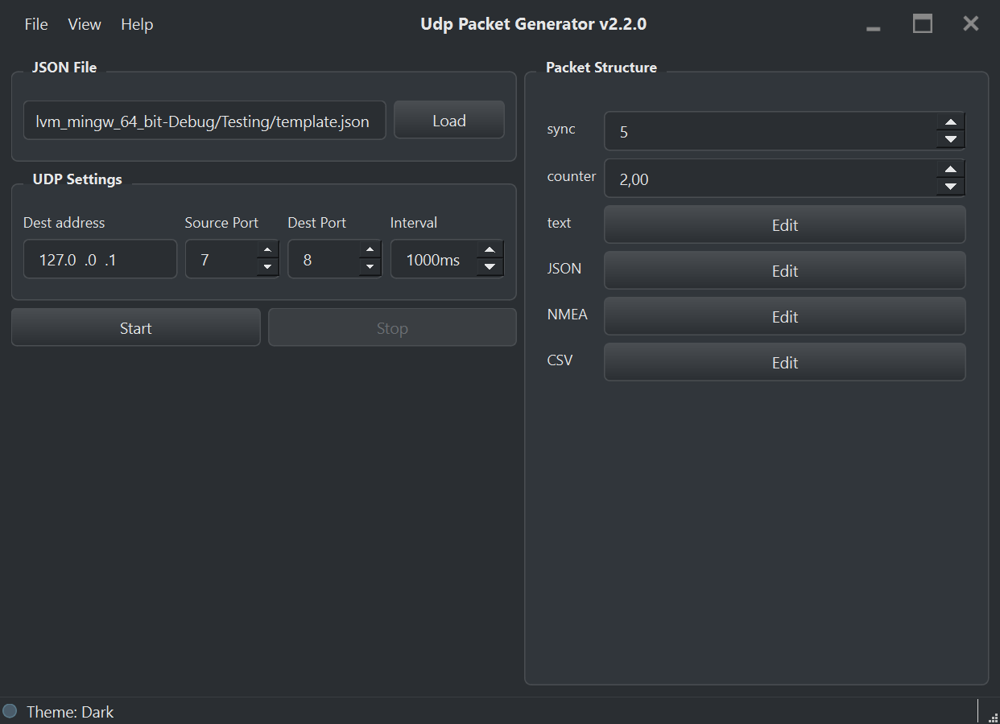
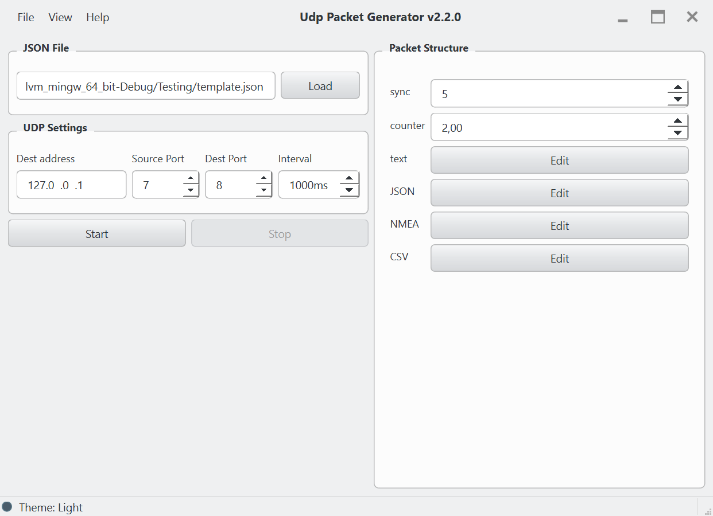
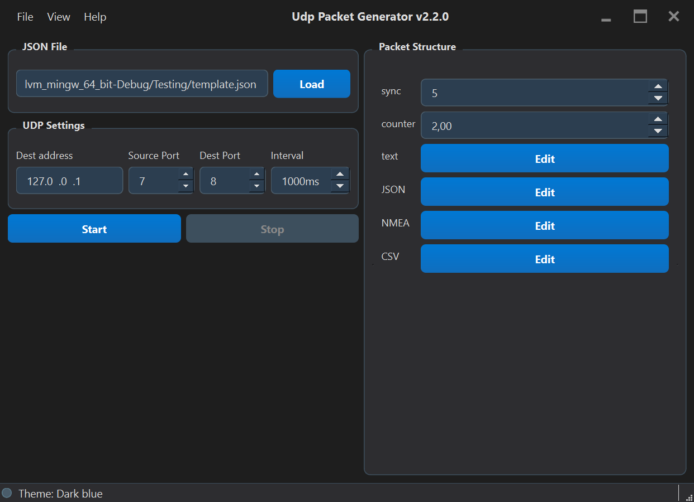
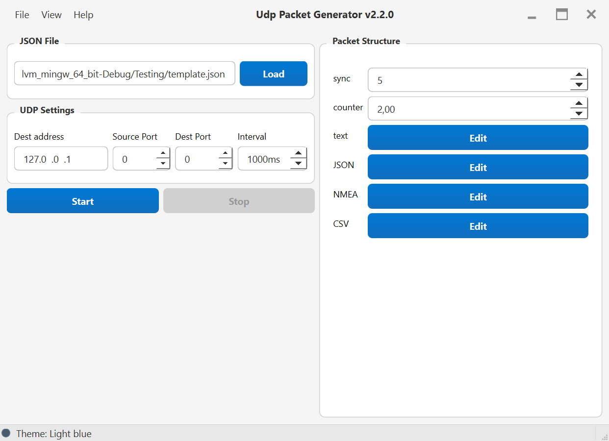

## [En](README.md) Ru

<h1 align="center">UDP Packet Generator</h1>
<div align="center">
    <a href="https://github.com/IamKornitskiy/UdpPacketGenerator/releases"></a>
    <a href="https://github.com/IamKornitskiy/UdpPacketGenerator/releases"></a>
    <a href="https://github.com/IamKornitskiy/UdpPacketGenerator/stargazers"></a>
    <a href="https://opensource.org/licenses/MIT"></a>
    <a href="https://www.qt.io/"></a>
    <a href="#"></a>
    <a href="https://github.com/IamKornitskiy/UdpPacketGenerator/actions/workflows/test.yaml"></a>
    <a href="#"></a>
</div>
<p align="center">
    
    <br><b>Гибкий генератор UDP-пакетов, настраиваемый с помощью JSON-шаблонов.</b></br>
</p>

## О проекте

**Инструмент для разработчиков сетевых протоколов, тестировщиков и инженеров.**  
> Настраивайте генерацию UDP-пакетов через простые JSON-шаблоны без перекомпиляции.

UDP Packet Generator создаёт и отправляет пользовательские UDP-пакеты по JSON-шаблону.  
Поля пакета могут быть разных типов — константы, счётчики или редактируемые значения.

### ✨ Почему UDP Packet Generator?

- **🚀 Активно развивающийся проект** — регулярные релизы, чёткий roadmap, обратная связь от сообщества 
- **📦 Готовые JSON-шаблоны** — в папке [`templates/`](templates/) уже есть примеры для быстрого старта
- **⚡ Без программирования** — определяйте пакеты в JSON, перекомпиляция не требуется
- **🔄 Редактирование в реальном времени** — меняйте значения во время отправки
- **🔧 Готовые типы полей** — NMEA, CSV, JSON, счётчики и другие — со встроенной проверкой
- **💻 Кроссплатформенность** — Windows и Linux с подписанными пакетами (deb, rpm, AppImage, zip)

## 📝 Пример JSON-шаблона

Минимальный пример шаблона пакета:

```json
{
  "fields": [
    { "name": "id", "type": "uint32", "value": 1 },
    { "name": "temperature", "type": "float32", "value": 23.5 },
    { "name": "status", "type": "string", "value": "OK" }
  ]
}
```

Этот шаблон определяет пакет с тремя полями:
- `id` — 32-битное целое без знака
- `temperature` — 32-битное число с плавающей точкой
- `status` — строка в кодировке UTF-8

Вы также можете использовать поля типа `"input"` для редактирования значений в GUI или `"counter"` для автоматического инкремента.

Больше примеров и подробное руководство по созданию шаблонов — в папке [`templates/`](templates/).

Если вы создали JSON-шаблон популярного протокола или пакета — отправляйте pull request, я с удовольствием добавлю его в коллекцию.

## 💡 Варианты использования

**Кому пригодится UDP Packet Generator?**

- **Тестирование сетевых протоколов** — эмулируйте клиентов и серверы без написания кода
- **Нагрузочное тестирование** — генерируйте поток пакетов с заданным интервалом
- **Разработка встроенных систем** — отправляйте телеметрию, NMEA или JSON на устройства
- **Обучение** — изучайте структуру UDP-пакетов и сетевые протоколы на практике

## 🗺 Дорожная карта

<details>
<summary><b>Нажмите, чтобы развернуть</b></summary>

### ✅ Уже реализовано (v2.1.x)
- [x] Целочисленные поля (`uint8`–`uint32`, `int8`–`int32`) с настраиваемым порядком байт
- [x] Поля с плавающей точкой (`float32`, `float64`)
- [x] Строковое поле (`string`) с поддержкой UTF-8
- [x] JSON-поле с автоматической проверкой синтаксиса
- [x] Автоинкрементный счётчик (`counter`)
- [x] Редактирование значений «на лету» без остановки отправки
- [x] Кроссплатформенная сборка (Windows, Linux) с подписанными пакетами (deb, rpm, AppImage, zip)
- [x] **CSV-поле** – проверка количества колонок
- [x] **Визуальная подсветка ошибок** в текстовых редакторах при некорректных данных
- [x] **NMEA-поле** с проверкой контрольной суммы
- [x] **Проверка наличия новой версии**

### 🚧 В активной разработке (v2.2.x)
- [ ] Дублирование пакетов на несколько адресов
- [ ] Сохранение/загрузка сценариев (значений полей)

### 🔜 Планируется (v2.3.x и далее)
- [ ] Визуальный редактор пакетов – создание полей перетаскиванием в GUI
- [ ] Base64-поле для безопасной передачи бинарных данных в текстовых протоколах
- [ ] Мониторинг трафика в реальном времени (скорость, счётчики, график)
- [ ] Дополнительные кодировки (Latin-1, UTF-16)
- [ ] Плагинная система для пользовательских типов полей и валидаторов
</details>

## 📸 Скриншоты

<details>
<summary><b>Нажмите, чтобы посмотреть</b></summary>
<table>
    <tr>
        <td></td>
        <td></td>
    </tr>
    <tr>
        <td></td>
        <td></td>
    </tr>
</table>
</details>

## Сборка

### Требования

- **Qt 6.8+** (модули Core, Gui, Widgets, Network)
- **CMake 3.16+**
- **Компилятор C++17** (MSVC 2019+, GCC 9+, Clang 10+)

```bash
git clone https://github.com/IamKornitskiy/UdpPacketGenerator.git
cd UdpPacketGenerator
mkdir build && cd build
cmake .. -DCMAKE_PREFIX_PATH=/path/to/Qt/6.8.0/gcc_64
cmake --build .
```

## Использование

1. **Загрузите JSON-шаблон** – нажмите `Load` и выберите файл `.json` с описанием пакета.
2. **Отредактируйте поля ввода** – если шаблон содержит поля `input`, задайте их значения в правой панели.
3. **Укажите адрес назначения** – IP и порт получателя.
4. **Укажите локальный порт (опционально)** – порт отправителя, или оставьте `0` для автоматического выбора.
5. **Выберите интервал** – период отправки в миллисекундах.
6. **Запустите** – нажмите `Start`, начнётся отправка пакетов.

## ❓ Поддержка и вопросы

- **Сообщения об ошибках и запросы функций** — создайте [issue на GitHub](https://github.com/IamKornitskiy/UdpPacketGenerator/issues)
- **Обсуждения** — используйте [GitHub Discussions](https://github.com/IamKornitskiy/UdpPacketGenerator/discussions) для вопросов и идей
- **Документация** — смотрите папку [`templates/`](templates/) и файл [`whatsnew.md`](whatsnew.md) с обновлениями

## 🙌 Вклад в проект

Приветствуются любые вклады! Пожалуйста, прочитайте [CONTRIBUTING_RU.md](CONTRIBUTING_RU.md) перед началом работы.

⭐ **Поставьте звезду репозиторию**, если он вам полезен — это поможет другим узнать о проекте!

## Лицензия

Проект распространяется под лицензией MIT – подробнее в файле [LICENSE](LICENSE).
